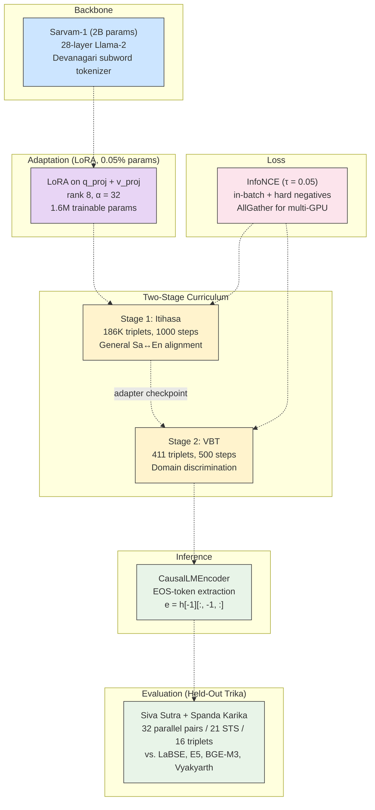
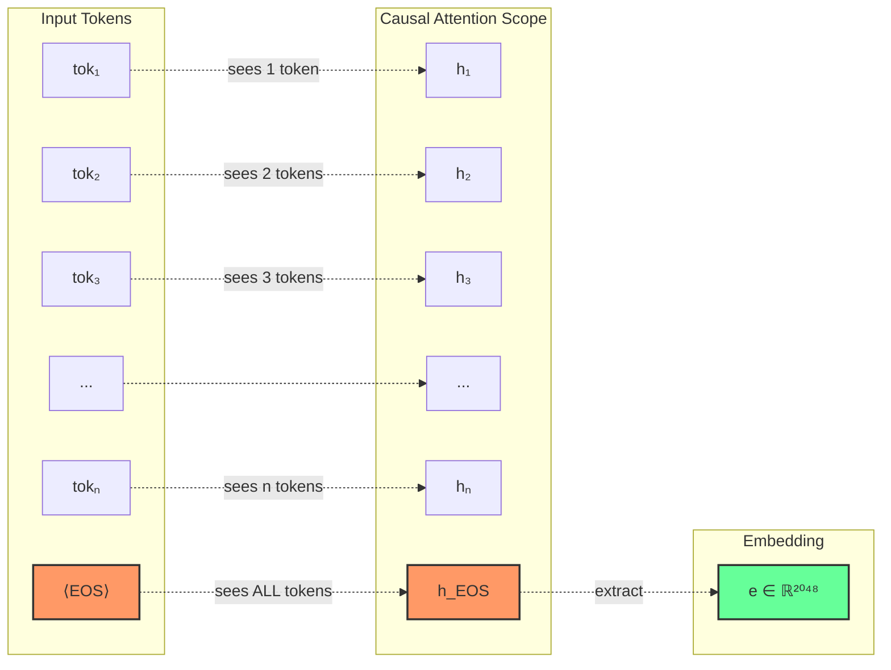
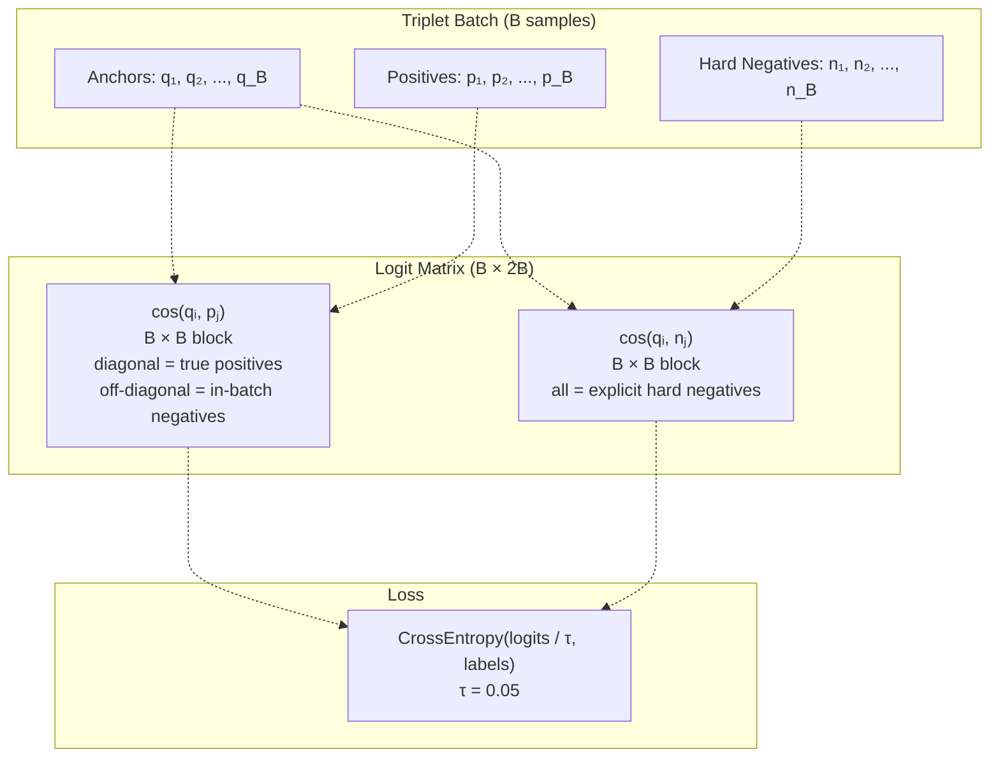
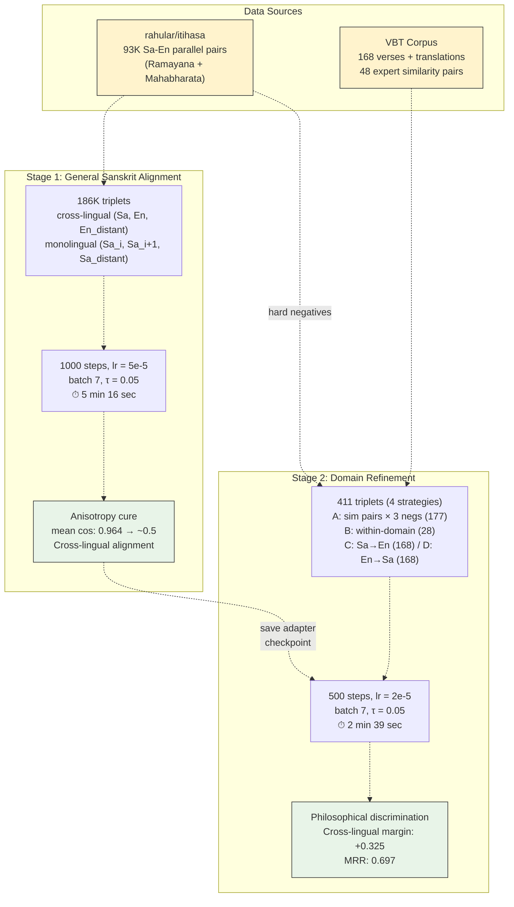
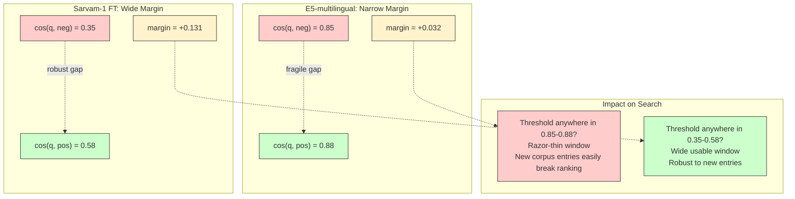
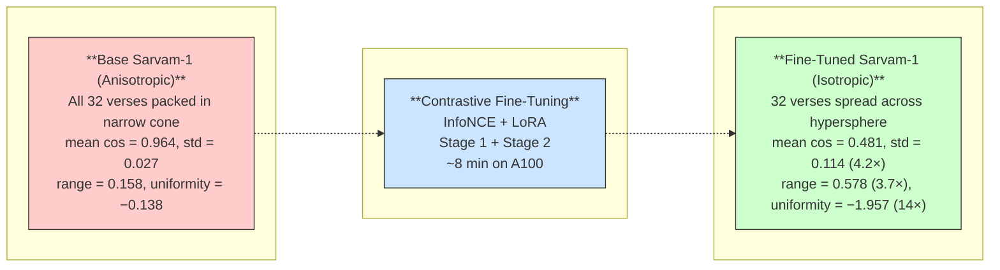
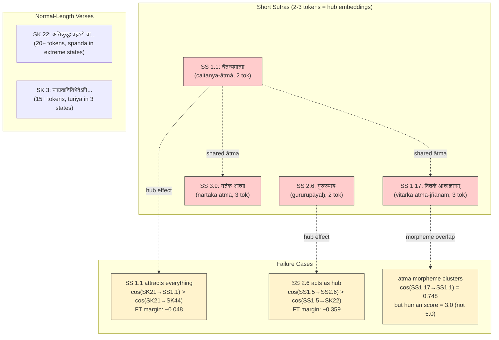

# Contrastive Fine-Tuning of a 2B Causal Language Model for Sanskrit Cross-Lingual Semantic Search

---

## Abstract

We present a method for repurposing a pre-trained causal language model as a cross-lingual sentence embedding model for Sanskrit-English semantic search. Starting from Sarvam-1, a 2-billion-parameter decoder-only LM pre-trained on 22 Indic languages, we apply Low-Rank Adaptation (LoRA) with InfoNCE contrastive loss in a two-stage curriculum: first on 186K general Sanskrit-English triplets from the Itihasa epic corpus, then on 411 domain-specific triplets from the Vijnanabhairava Tantra (VBT). The resulting model is evaluated on held-out Trika philosophical texts (Siva Sutra and Spanda Karika) and compared against four off-the-shelf multilingual embedding models (LaBSE, E5-multilingual, BGE-M3, Vyakyarth). Our fine-tuned model achieves the highest overall discrimination margin (+0.131) and the strongest cross-lingual discrimination (+0.325, nearly 2x the nearest baseline), while transforming the base model's pathological embedding anisotropy (mean pairwise cosine 0.964) into a usable distribution (0.481). Training requires under 8 minutes on a single A100 GPU and modifies only 0.05% of model parameters. We identify a "short-sutra hub" problem affecting all models and propose directions for improving monolingual Sanskrit discrimination.

---

## 1. Introduction

Sanskrit, one of the world's oldest literary languages, has a vast corpus of philosophical, religious, scientific, and literary texts spanning three millennia. Despite growing interest in computational tools for Sanskrit (Hellwig, 2016; Goyal & Huet, 2016), the fundamental infrastructure for semantic search over Sanskrit texts remains undeveloped. No pre-trained sentence embedding model exists with meaningful Sanskrit representation, and the unique morphological complexity of Sanskrit -- with its extensive sandhi (phonological fusion), compound formation, and rich inflectional system -- makes it poorly served by multilingual models trained predominantly on European and East Asian languages.

This paper addresses a specific applied problem: building a semantic search system for Sanskrit philosophical texts in the Trika (Kashmir Saiva) tradition. Given a verse from one of several related texts, the system should retrieve thematically related verses both within Sanskrit and across Sanskrit-English translation pairs. The target corpus includes texts like the Siva Sutra (77 aphoristic sutras), Spanda Karika (52 verses on the nature of consciousness-vibration), and Vijnanabhairava Tantra (112 meditation techniques) -- all concerned with interconnected philosophical themes but written in different literary forms by different authors across several centuries.

The core challenge is data scarcity. The domain-specific annotated data consists of only ~48 expert-annotated similarity pairs among 168 VBT verses. This is far too little for training a sentence embedding model from scratch, but sufficient for targeted adaptation of an existing model.

Our approach exploits three resources: (1) a Sanskrit-capable causal LM (Sarvam-1, 2B params) that has already learned Devanagari subword morphology during pre-training; (2) a large parallel Sanskrit-English corpus (Itihasa, 93K pairs) for general cross-lingual alignment; and (3) a small set of expert-annotated verse similarity pairs for domain-specific refinement. We combine these via LoRA contrastive fine-tuning in a two-stage curriculum, transforming the causal LM's last-token hidden states into discriminative sentence embeddings.

The main contributions are:

1. A practical method for converting a causal LM into a cross-lingual sentence embedding model for a low-resource language, requiring only 8 minutes of single-GPU training and 0.05% parameter modification.

2. A held-out evaluation benchmark for Sanskrit semantic search comprising 32 parallel verse pairs, 21 human-annotated STS pairs, and 16 discrimination triplets across three difficulty categories, drawn from texts unseen during training.

3. A systematic comparison against four production-quality multilingual embedding models, revealing that targeted contrastive fine-tuning of a 2B causal LM can match or exceed 560M-parameter sentence-BERT models on cross-lingual retrieval and discrimination.

4. Analysis of failure modes, including the identification of a "short-sutra hub" effect where ultra-short inputs produce degenerate embeddings, and a detailed characterization of per-category discrimination behavior.

---

## 2. Related Work

### 2.1 Sentence Embedding Models

Dense sentence embeddings from pre-trained transformers have become the standard approach for semantic textual similarity and retrieval. SBERT (Reimers & Gurevych, 2019) demonstrated that fine-tuning BERT with a Siamese/triplet objective produces sentence embeddings that dramatically outperform direct BERT-[CLS] extraction. Subsequent work has scaled this to multilingual settings: LaBSE (Feng et al., 2022) trains a dual-encoder with translation ranking loss on 109 languages; E5 (Wang et al., 2022) uses weakly-supervised contrastive pre-training followed by fine-tuning; BGE-M3 (Chen et al., 2024) introduces multi-granularity retrieval supporting dense, lexical, and multi-vector modes.

All of these are encoder (BERT-style) architectures trained on data distributions dominated by high-resource languages. Their Sanskrit representations are incidental -- learned from whatever Sanskrit text appeared in the pre-training corpus (typically very little) -- rather than deliberate.

### 2.2 Embeddings from Causal LMs

Recent work has shown that decoder-only LMs can produce competitive sentence embeddings. PromptEOL (Jiang et al., 2023) prompts the LM to "summarize" the input, extracting the embedding from the last token of the generated prompt. LLM2Vec (BehnamGhader et al., 2024) converts decoder models to bidirectional encoders by enabling causal attention masking, then fine-tunes with SimCSE. GritLM (Muennighoff et al., 2024) unifies text generation and embedding in a single model.

Our approach is simpler: we directly use the last hidden state at the EOS token as the sentence embedding, without prompt engineering or architectural modification. The key insight is that the causal LM's EOS-token representation already functions as a sequence summary (it attends to all preceding tokens), and contrastive fine-tuning with LoRA can reshape this representation into a discriminative embedding space while preserving the pre-trained language understanding.

### 2.3 Sanskrit NLP

Computational Sanskrit research has focused primarily on morphological analysis (Goyal & Huet, 2016), sandhi splitting (Hellwig, 2016; Reddy et al., 2018), and dependency parsing. The Heritage Sanskrit platform provides comprehensive lexical and grammatical tools. However, sentence-level semantic tasks -- including STS, retrieval, and classification -- remain largely unexplored.

Sarvam-1 (Sarvam AI, 2024) is a 2B-parameter Llama-2-based model pre-trained on 22 Indian languages including Sanskrit. While primarily designed for text generation, its Devanagari-aware tokenizer and substantial Indic language pre-training make it a natural backbone for Sanskrit embedding tasks.

Vyakyarth (Krutrim AI Labs, 2025) is an Indic-specific sentence embedding model based on a BERT encoder, trained on Indian languages. We include it in our evaluation as the closest existing Indic embedding model.

### 2.4 Low-Rank Adaptation (LoRA)

LoRA (Hu et al., 2022) freezes pre-trained model weights and injects trainable low-rank decomposition matrices into transformer layers, enabling parameter-efficient fine-tuning with 0.01-1% of total parameters. This is particularly suited to our setting: with only 411 domain-specific training samples, full fine-tuning of a 2B model would risk catastrophic forgetting of the pre-trained Sanskrit representations. LoRA constrains adaptation to a low-rank manifold that is expressive enough to reorganize the embedding geometry while preserving learned language structure.

---

## 3. Method

**Figure 0: System overview.** A pre-trained causal LM is adapted into a sentence embedding model via LoRA contrastive fine-tuning in two stages, then evaluated on held-out Trika texts against off-the-shelf baselines.

### 3.1 Backbone Model

We use Sarvam-1 (2B parameters, 28-layer Llama-2 architecture) as the backbone. Sarvam-1 was pre-trained on a large multilingual corpus covering 22 Indian languages including Sanskrit, with a vocabulary of 68,096 tokens featuring Devanagari subword units.

**Tokenization quality.** Sanskrit tokenization quality is a critical consideration. Sarvam-1 tokenizes Sanskrit at approximately 3.9x fertility (tokens per word), producing meaningful Devanagari subwords. By contrast, models without dedicated Devanagari vocabulary (e.g., MiniCPM-2B) resort to byte-level fallback at ~12x fertility, producing opaque byte sequences that carry no morphological information. Since our embedding strategy extracts a single vector from the final token's hidden state, each token position must carry maximal semantic weight -- meaningful subwords are strictly preferable to arbitrary byte fragments.

### 3.2 Embedding Extraction

Given an input sentence, we tokenize it with `add_eos_token=True` (enforced programmatically in all code paths) and extract the hidden state at the final token position from the last transformer layer:

$$\mathbf{e} = \mathbf{h}^{(L)}_{T}$$

where $\mathbf{h}^{(L)}_{T}$ is the hidden state at position $T$ (the EOS token) of layer $L$ (the final layer), and $\mathbf{e} \in \mathbb{R}^{2048}$.

**Figure 1: EOS-token embedding extraction from a causal LM.** Each token attends only to itself and all preceding tokens (causal mask). The EOS token at position $T$ is the only position with full-sequence context, making it the natural extraction point.

**Rationale.** In a causal (left-to-right) model, only the final token has attended to every preceding token via the causal attention mask. The EOS token provides a consistent extraction point across inputs of varying length -- a dedicated "summarize everything before me" position. This is the same position the model uses to predict the next token during pre-training, so it already encodes a compressed representation of the full input sequence.

### 3.3 LoRA Configuration

We apply LoRA to the query (`q_proj`) and value (`v_proj`) projection matrices in all 28 self-attention layers:

$$\mathbf{W}' = \mathbf{W} + \frac{\alpha}{r}\mathbf{B}\mathbf{A}$$

with rank $r = 8$, scaling factor $\alpha = 32$ (effective scaling $\alpha / r = 4$), dropout 0.1, and Gaussian initialization. This yields 1,605,632 trainable parameters -- 0.05% of the 2B total.

**Target module selection.** The query and value projections control *what the model attends to* and *what information flows forward*, respectively. Adapting both enables redirecting attention patterns toward semantically discriminative features. The key projection (`k_proj`) is deliberately excluded: keys determine token-level similarity for attention weighting, and modifying them alongside queries creates conflicting learning signals. Output projections and MLP layers are excluded to minimize parameter count.

**Effective learning rate scaling.** The $\alpha / r = 4$ scaling means LoRA updates have 4x the magnitude of standard gradient updates. This aggressive scaling is appropriate for our goal: the base model's embedding space exhibits pathological anisotropy (mean pairwise cosine 0.964; see Section 5.3), and significant geometric reorganization is needed within a limited training budget.

### 3.4 Contrastive Loss

We use InfoNCE (Oord et al., 2018) with explicit hard negatives and in-batch negatives:

$$\mathcal{L} = -\frac{1}{B} \sum_{i=1}^{B} \log \frac{\exp(\text{sim}(\mathbf{q}_i, \mathbf{p}_i) / \tau)}{\sum_{j=1}^{B} \exp(\text{sim}(\mathbf{q}_i, \mathbf{p}_j) / \tau) + \sum_{j=1}^{B} \exp(\text{sim}(\mathbf{q}_i, \mathbf{n}_j) / \tau)}$$

where $\mathbf{q}_i$, $\mathbf{p}_i$, $\mathbf{n}_i$ are the L2-normalized embeddings of the anchor, positive, and hard negative for sample $i$; $\text{sim}(\cdot, \cdot)$ is cosine similarity; and $\tau = 0.05$ is the temperature.

Each query sees: (1) its own positive at the diagonal position, (2) $B-1$ in-batch positives as implicit negatives, and (3) $B$ explicit hard negatives from the `hard_neg` column. The hard negatives are critical for learning fine-grained distinctions; in-batch negatives alone tend to be "easy" (random sentences from the training corpus). Temperature $\tau = 0.05$ is aggressive, sharpening the softmax distribution to be highly sensitive to small cosine differences -- necessary when the starting representation compresses all Sanskrit text into a cosine range of 0.84--1.00.

**Figure 2: InfoNCE logit matrix structure.** For batch size $B$, each query $\mathbf{q}_i$ is scored against all positives (left block) and all hard negatives (right block). The correct positive for query $i$ lies at diagonal position $i$ in the left block (marked with checkmarks). All other entries serve as negatives.

For multi-GPU training, we use a custom `AllGather` autograd function to collect embeddings across GPUs, creating a global negative pool of $B \times \text{world\_size}$. The backward pass uses `all_reduce(SUM)` to aggregate gradients, with each rank slicing out its local portion.

### 3.5 Two-Stage Training Curriculum

The target domain has only 411 annotated triplets -- insufficient for learning Sanskrit sentence understanding from scratch. However, 93K parallel Itihasa pairs provide abundant general cross-lingual alignment signal. We exploit this asymmetry with a two-stage curriculum:

**Stage 1: General Sanskrit alignment (Itihasa).** We generate 186K triplets from the `rahular/itihasa` dataset, which contains 93K Sanskrit-English parallel pairs from the Ramayana and Mahabharata epics:

- *Cross-lingual triplets*: (Sanskrit$_i$, English$_i$, English$_j$) where $|i - j| \geq 100$ positions
- *Monolingual Sanskrit triplets*: (Sanskrit$_i$, Sanskrit$_{i+1}$, Sanskrit$_j$) where $|i - j| \geq 100$ positions

The $\geq$100 position gap for negatives ensures thematic distance without requiring chapter metadata. Adjacent verses in epic narrative are narratively continuous and therefore thematically related, providing natural positive pairs.

Training: 1,000 steps, batch size 7, learning rate $5 \times 10^{-5}$ with cosine schedule and 100-step warmup. Duration: 5 minutes 16 seconds on a single NVIDIA A100-SXM4-40GB.

**Stage 2: Domain-specific refinement (VBT).** We generate 411 triplets from 168 VBT verses using four strategies:

| Strategy | Count | Description |
|----------|-------|-------------|
| A: Similarity pairs | 177 | Each expert-annotated similarity pair $\times$ 3 Itihasa negatives |
| B: Within-domain expansion | 28 | Combinatorial pairs within union-find practice domains |
| C: Cross-lingual Sa$\rightarrow$En | 168 | (VBT verse, VBT translation, Itihasa English negative) |
| D: Cross-lingual En$\rightarrow$Sa | 168 | (VBT translation, VBT verse, Itihasa Sanskrit negative) |

**Domain discovery via union-find.** Strategy B uses union-find over the expert similarity pairs to discover practice domains (connected components of related verses). This yields 29 small domains rather than the expected 8--10 larger groups, indicating that the expert annotations are sparse.

**Negative source.** All hard negatives are sourced from the Itihasa corpus rather than cross-domain VBT verses. All 168 VBT verses describe dharana (concentration) practices and share heavy thematic overlap even across technique categories. Using VBT cross-domain negatives would teach the model that "breath meditation" and "sound meditation" are unrelated, contradicting the actual semantic structure. Itihasa epic narrative (battles, genealogies, court intrigue) provides genuinely distinct negative signal.

Training: 500 steps, batch size 7, learning rate $2 \times 10^{-5}$ with cosine schedule and 50-step warmup. The Stage 1 adapter is loaded with `PeftModel.from_pretrained(model, path, is_trainable=True)`. Duration: 2 minutes 39 seconds.

**Figure 3: Two-stage training curriculum.** Stage 1 builds general Sanskrit-English alignment from a large parallel corpus. The saved adapter is then loaded for Stage 2, which refines discrimination on domain-specific philosophical texts. All hard negatives come from the Itihasa corpus (dashed red) to avoid teaching the model that thematically related VBT verses are dissimilar.

**Total training time: 7 minutes 55 seconds.** Total compute cost: approximately \$0.30 at Lambda Cloud A100 pricing.

---

## 4. Evaluation Setup

### 4.1 Held-Out Test Data

To ensure an uncontaminated evaluation, we use texts from the Trika tradition that were not seen during training. The training data consists of Itihasa (Ramayana + Mahabharata) and VBT (Vijnanabhairava Tantra) texts. The evaluation data consists of:

- **Siva Sutra** (Vasugupta, ~9th century): 20 selected aphoristic sutras from across the three sections, with English translations
- **Spanda Karika** (Vasugupta/Kallata, ~9th century): 12 selected verses on the nature of spanda (vibration/pulsation), with English translations

These texts belong to the same philosophical tradition (Kashmir Saivism) as the VBT training data but are different works by different authors in different literary forms. The Siva Sutras are terse aphorisms (often 2--4 words), while the Spanda Karikas are full metrical verses. This diversity tests whether the model has learned generalizable Sanskrit semantic representations rather than memorized VBT-specific patterns.

### 4.2 Evaluation Metrics

We evaluate four complementary aspects of embedding quality:

**Cross-lingual retrieval.** Given the 32 parallel verse pairs (Sanskrit $\leftrightarrow$ English), we compute MRR and Recall@k ($k \in \{1, 3, 5\}$) for both En$\rightarrow$Sa and Sa$\rightarrow$En retrieval. Each query retrieves from a corpus of 32 candidates; the correct match is the parallel translation at the same index.

**STS correlation.** 21 verse pairs were annotated by a domain expert with similarity scores on a 0--5 scale (5 = paraphrase, 0 = unrelated). We compute Spearman $\rho$ and Pearson $r$ between model cosine similarity and human scores.

**Triplet discrimination.** 16 triplets across three difficulty categories test whether $\text{sim}(\text{anchor}, \text{positive}) > \text{sim}(\text{anchor}, \text{negative})$:
- *Monolingual Sanskrit* (8 triplets): anchor and candidates are all Sanskrit verses; positive shares a theme with anchor, negative does not
- *Cross-lingual* (6 triplets): Sanskrit anchor, English positive (own translation), English negative (different verse's translation)
- *Hard* (2 triplets): positive and negative are both semantically related to the anchor, requiring fine-grained philosophical distinction

We report accuracy (fraction correct) and mean margin ($\text{sim}_{\text{pos}} - \text{sim}_{\text{neg}}$), which measures the robustness of the discrimination signal.

**Anisotropy.** For the 32 Sanskrit verse embeddings, we compute pairwise cosine statistics (mean, std, min, max, range) and the Wang & Isola (2020) uniformity metric:

$$\mathcal{U} = \log \mathbb{E}_{i \neq j}\left[\exp\left(-2\|\mathbf{z}_i - \mathbf{z}_j\|^2\right)\right]$$

where $\mathbf{z}_i$ are L2-normalized embeddings. Lower uniformity indicates more uniform distribution on the unit hypersphere.

### 4.3 Baseline Models

We compare against four off-the-shelf multilingual embedding models available through the `sentence-transformers` library:

| Model | Parameters | Architecture | Multilingual Coverage | Notes |
|-------|------------|-------------|----------------------|-------|
| LaBSE | 471M | BERT-based dual encoder | 109 languages | Translation ranking loss |
| E5-multilingual | 560M | BERT-based, instruct-tuned | 100+ languages | Requires `query:` prefix |
| BGE-M3 | 568M | BERT-based, multi-granularity | 100+ languages | Dense + sparse + multi-vector |
| Vyakyarth | ~560M | BERT-based, Indic-specific | Indian languages | Krutrim AI Labs |

We also include the base Sarvam-1 (without LoRA adapter) to measure the raw effect of contrastive fine-tuning.

---

## 5. Results

### 5.1 Summary

Table 1 presents the main results across all models and metrics.

**Table 1: Main results on held-out Trika evaluation data.**

| Model | MRR | R@1 | R@5 | $\rho$ | Trip. Acc | Discrim. | Uniform. |
|-------|-----|-----|-----|--------|-----------|----------|----------|
| LaBSE | 0.731 | 62.5% | 84.4% | 0.291 | 75.0% | +0.119 | -2.684 |
| E5-multilingual | 0.764 | 65.6% | 90.6% | 0.273 | 68.8% | +0.032 | -0.564 |
| BGE-M3 | 0.784 | 70.3% | 87.5% | 0.537 | 75.0% | +0.092 | -2.169 |
| Vyakyarth | 0.577 | 46.9% | 68.8% | 0.116 | 43.8% | +0.070 | -2.435 |
| Sarvam-1 (base) | 0.132 | 1.6% | 17.2% | -0.174 | 56.2% | +0.008 | -0.138 |
| **Sarvam-1 (FT)** | **0.697** | **56.2%** | **89.1%** | **0.323** | **62.5%** | **+0.131** | **-1.957** |

MRR, R@1, R@5 are averaged over En$\rightarrow$Sa and Sa$\rightarrow$En directions. Trip. Acc = triplet accuracy (16 triplets). Discrim. = mean margin (sim$_\text{pos}$ - sim$_\text{neg}$). Uniform. = Wang & Isola (2020) uniformity (lower is better).

The fine-tuned model achieves the highest overall discrimination margin (+0.131), competitive cross-lingual retrieval (MRR 0.697, R@5 89.1%), and the largest transformation from base model behavior (MRR 0.132 $\rightarrow$ 0.697, uniformity -0.138 $\rightarrow$ -1.957). BGE-M3 leads on MRR (0.784) and STS correlation ($\rho = 0.537$), while LaBSE offers the best monolingual Sanskrit discrimination.

### 5.2 Discrimination Analysis

For semantic search, the critical quality signal is not raw retrieval rank but **discrimination margin** -- the model's ability to separate related from unrelated pairs by a usable gap in cosine space. A model with high MRR but tiny margins is fragile: any new text, noise, or threshold choice can break the ranking.

**Figure 5: Discrimination margin determines search robustness.** Two models may rank correctly (positive above negative), but only a wide margin survives threshold selection and corpus expansion. E5's narrow margin (+0.032) means a single new verse could flip the ranking; Sarvam-1 FT's wider margin (+0.131) provides a stable gap.

**Table 2: Per-category discrimination.**

| Model | Mono-Sa (8) | Cross-lingual (6) | Hard (2) |
|-------|-------------|-------------------|----------|
| | acc / mean margin | acc / mean margin | acc / mean margin |
| **Sarvam-1 (FT)** | 3/8 / +0.006 | **6/6 / +0.325** | 1/2 / -0.066 |
| LaBSE | **6/8 / +0.115** | 6/6 / +0.172 | 0/2 / -0.023 |
| BGE-M3 | **6/8 / +0.077** | 6/6 / +0.162 | 0/2 / -0.059 |
| E5-multilingual | 5/8 / +0.019 | 6/6 / +0.064 | 0/2 / -0.009 |
| Vyakyarth | 1/8 / -0.089 | 5/6 / +0.279 | 1/2 / +0.076 |
| Sarvam-1 (base) | 3/8 / -0.001 | 4/6 / +0.018 | 2/2 / +0.018 |

Three findings emerge:

**Cross-lingual discrimination is the fine-tuned model's clear advantage.** The mean cross-lingual margin of +0.325 is nearly 2x LaBSE (+0.172) and 5x E5 (+0.064). The widest single margin is +0.531 (SS 1.1 Sanskrit vs. its English translation vs. an unrelated English translation). This reflects the training curriculum's emphasis on cross-lingual alignment via Itihasa (Stage 1) and VBT cross-lingual strategies C/D (Stage 2).

**Monolingual Sanskrit discrimination is the primary weakness.** The fine-tuned model achieves only 3/8 accuracy with a mean margin of +0.006 on monolingual Sanskrit triplets. LaBSE (6/8, +0.115) and BGE-M3 (6/8, +0.077) substantially outperform it. However, the fine-tuned model's monolingual performance is bimodal: it succeeds by large margins on some triplets (+0.287 for the SS 1.22/SS 2.1 mantra pair, +0.251 for the SS 1.7/SK 3 turiya pair) but fails catastrophically on others (-0.359 for SS 1.5/SK 22 vs. SS 2.6).

**No model solves the hard triplets.** When positive and negative are both semantically related to the anchor (e.g., three verses all about atman, or three about spanda/states), every model except Vyakyarth has negative mean margin. These require understanding subtle philosophical distinctions -- "this verse about consciousness-as-Self is more closely related to this verse about Self-knowledge than to this verse about the cosmic dancer" -- that no current embedding model captures.

**Table 3: Per-triplet margins (selected).**

| Category | Triplet | LaBSE | E5 | BGE-M3 | FT |
|----------|---------|-------|-----|--------|-----|
| mono_sa | SS 1.7 <> SK 3 vs SS 3.45 | +0.314 | +0.031 | +0.169 | +0.251 |
| mono_sa | SS 1.5 <> SK 22 vs SS 2.6 | -0.189 | -0.046 | -0.025 | -0.359 |
| mono_sa | SS 1.22 <> SS 2.1 vs SK 9 | +0.239 | +0.016 | +0.122 | +0.287 |
| mono_sa | SK 21 <> SK 44 vs SS 1.1 | +0.300 | +0.091 | +0.188 | -0.048 |
| cross | SS 1.1 Sa <> En vs SS 3.45 En | +0.212 | +0.047 | +0.183 | +0.531 |
| cross | SS 1.7 Sa <> En vs SK 48 En | +0.082 | +0.012 | +0.073 | +0.370 |
| hard | SS 1.1 <> SS 1.17 vs SS 3.9 (atma) | -0.041 | -0.006 | -0.013 | +0.039 |
| hard | SK 3 <> SK 17 vs SK 21 (spanda) | -0.005 | -0.012 | -0.104 | -0.171 |

### 5.3 Embedding Space Geometry

**Table 4: Pairwise cosine statistics over 32 Sanskrit verse embeddings.**

| Model | Mean | Std | Min | Max | Range |
|-------|------|-----|-----|-----|-------|
| LaBSE | 0.294 | 0.130 | -0.069 | 0.685 | 0.753 |
| E5-multilingual | 0.857 | 0.034 | 0.772 | 0.941 | 0.169 |
| BGE-M3 | 0.444 | 0.080 | 0.264 | 0.743 | 0.479 |
| Vyakyarth | 0.355 | 0.134 | -0.031 | 0.850 | 0.881 |
| Sarvam-1 (base) | 0.964 | 0.027 | 0.840 | 0.998 | 0.158 |
| Sarvam-1 (FT) | 0.481 | 0.114 | 0.192 | 0.770 | 0.578 |

The pairwise cosine distribution reveals the geometric mechanism behind discrimination:

**Figure 4: Embedding space geometry before and after contrastive fine-tuning.** The base model confines all verse embeddings to a narrow anisotropic cone (range 0.16). Contrastive training spreads them across a 3.7x wider region of the hypersphere, enabling meaningful similarity gradients.

**Anisotropy collapse in base model.** The base Sarvam-1 confines all 32 Sanskrit verse embeddings to a narrow cone: cosines range from 0.840 to 0.998 with standard deviation 0.027. This is the well-known anisotropy problem in language model representations (Ethayarajh, 2019; Li et al., 2020) -- the embedding space degenerates to a narrow cone around a dominant direction, making all sentences appear nearly identical. Contrastive training eliminates this, spreading embeddings to a range of 0.192--0.770 with 4.2x wider standard deviation.

**E5's high MRR is misleading.** E5-multilingual achieves the second-highest MRR (0.764) but has a pairwise cosine range of only 0.169 (0.772--0.941). All 32 Sanskrit verses land within a 0.17-wide band. While ordinal ranking within this band produces reasonable MRR, a threshold-based search system has almost no room to distinguish "relevant" from "irrelevant." The mean discrimination margin of +0.032 confirms this: E5's Sanskrit embedding space is nearly flat.

**LaBSE and FT offer the most usable geometry.** LaBSE's cosine range of 0.753 (including negative values) provides maximum room for threshold-based filtering. The fine-tuned model's range of 0.578 is comparable, with a notably low minimum pairwise cosine (0.192) indicating it can push truly unrelated verse pairs far apart.

For a practical semantic search system, standard deviation determines how many "buckets" of similarity the model can distinguish. A model with std = 0.027 (base) has effectively one bucket; std = 0.130 (LaBSE) provides 5--6 meaningful gradations.

### 5.4 Cross-Lingual Retrieval

**Table 5: Cross-lingual retrieval detail by direction.**

| Model | En$\rightarrow$Sa MRR | R@1 | R@3 | R@5 | Sa$\rightarrow$En MRR | R@1 | R@3 | R@5 |
|-------|-----|-----|-----|-----|-----|-----|-----|-----|
| LaBSE | 0.712 | 59.4% | 75.0% | 87.5% | 0.750 | 65.6% | 81.2% | 81.2% |
| E5-multilingual | 0.800 | 71.9% | 84.4% | 90.6% | 0.728 | 59.4% | 87.5% | 90.6% |
| BGE-M3 | 0.719 | 62.5% | 75.0% | 84.4% | 0.849 | 78.1% | 90.6% | 90.6% |
| Vyakyarth | 0.632 | 53.1% | 68.8% | 78.1% | 0.522 | 40.6% | 53.1% | 59.4% |
| Sarvam-1 (base) | 0.134 | 3.1% | 9.4% | 12.5% | 0.130 | 0.0% | 12.5% | 21.9% |
| **Sarvam-1 (FT)** | **0.718** | **62.5%** | **75.0%** | **84.4%** | **0.675** | **50.0%** | **78.1%** | **93.8%** |

The fine-tuned model achieves the highest R@5 for Sa$\rightarrow$En retrieval (93.8%): for nearly every Sanskrit verse, the correct English translation appears in the top 5 results. Its En$\rightarrow$Sa MRR (0.718) matches BGE-M3 exactly. Overall MRR (0.697) places it in the same tier as LaBSE (0.731), below BGE-M3 (0.784) and E5 (0.764).

The base Sarvam-1 is essentially random (MRR 0.132, R@1 1.6%), confirming that the cross-lingual capability is entirely learned through contrastive fine-tuning.

### 5.5 STS Correlation

**Table 6: STS correlation on 21 human-annotated pairs.**

| Model | Spearman $\rho$ | Pearson $r$ |
|-------|-------|------|
| BGE-M3 | **0.537** | **0.509** |
| Sarvam-1 (FT) | 0.323 | 0.207 |
| LaBSE | 0.291 | 0.287 |
| E5-multilingual | 0.273 | 0.219 |
| Vyakyarth | 0.116 | 0.008 |
| Sarvam-1 (base) | -0.174 | -0.220 |

BGE-M3's $\rho = 0.537$ substantially leads the field, maintaining a monotonic trend from cosine 0.34 (human score 0) to 0.63 (human score 5) with the widest gaps between similarity tiers.

The fine-tuned model's $\rho = 0.323$ is moderate. Per-pair analysis reveals why: it correctly identifies extremes (high cosine for related pairs, lower for unrelated) but over-ranks certain middle-range pairs due to surface morpheme overlap. Specifically, the pair SS 1.17 ("vitarka atmajnanam") and SS 1.1 ("caitanyamatma"), annotated at human score 3.0, receives a model cosine of 0.748 -- higher than the 5.0-rated pair SS 1.7 and SK 17 (cosine 0.291). Both SS 1.17 and SS 1.1 are ultra-short sutras (2--3 words) sharing the root *atma*, and their surface overlap inflates cosine beyond what their conceptual similarity warrants.

**Table 7: Selected STS pair cosines across the similarity scale.**

| Human | Pair | LaBSE | E5 | BGE-M3 | FT |
|-------|------|-------|-----|--------|-----|
| 5.0 | SS 1.7 <> SK 3 (turiya in 3 states) | 0.556 | 0.901 | 0.627 | 0.723 |
| 5.0 | SS 1.7 <> SK 17 (turiya/spanda) | 0.426 | 0.870 | 0.513 | 0.291 |
| 3.0 | SS 1.17 <> SS 1.1 (atma-jnana) | 0.566 | 0.875 | 0.523 | **0.748** |
| 0.0 | SS 1.1 <> SS 3.45 (consciousness/pranayama) | 0.425 | 0.816 | 0.397 | 0.389 |
| 0.0 | SS 2.6 <> SS 3.45 (guru/pranayama) | 0.147 | 0.817 | 0.338 | 0.419 |

### 5.6 Effect of Contrastive Training on Anisotropy

**Table 8: Anisotropy before and after contrastive fine-tuning.**

| Metric | Base | Fine-tuned | Change |
|--------|------|-----------|--------|
| Mean pairwise cosine | 0.964 | 0.481 | -0.483 |
| Standard deviation | 0.027 | 0.114 | 4.2x wider |
| Cosine range | 0.158 | 0.578 | 3.7x wider |
| Uniformity | -0.138 | -1.957 | 14x improvement |

Contrastive training produces a dramatic geometric transformation. The uniformity metric improves 14x, approaching the level of purpose-built embedding models (LaBSE: -2.684, BGE-M3: -2.169). This confirms that the InfoNCE loss with $\tau = 0.05$ successfully breaks the anisotropic cone and distributes embeddings more uniformly on the hypersphere.

### 5.7 Training Dynamics

**Table 9: Training loss progression.**

| Stage | Initial Loss | Final Loss | Mean Loss | Duration |
|-------|-------------|-----------|-----------|----------|
| Stage 1 (Itihasa, 186K) | 2.61 | 1.20 | 2.06 | 5:16 |
| Stage 2 (VBT, 411) | 3.36 | 0.33 | 0.77 | 2:39 |

Stage 2 begins with higher loss (3.36) despite starting from the Stage 1 checkpoint, because the domain-specific VBT data is distributionally different from Itihasa. The loss drops sharply in the first epoch (to ~1.5 by step 50) and converges to 0.33, indicating that the small dataset is well-fitted within the 500-step budget.

The Stage 2 loss trajectory shows the model iterating through the 411-sample dataset ~8.5 epochs ($500 \times 7 / 411$). The final loss of 0.33 corresponds to approximately correct ranking of $\exp(-0.33) \approx 72\%$ of the negative candidates in each batch, which is consistent with the 62.5% triplet accuracy observed on held-out data.

---

## 6. Analysis

### 6.1 The Short-Sutra Hub Problem

A recurring failure mode across all models is that ultra-short inputs (2--3 tokens) produce embeddings that act as "hubs" -- points in embedding space that are artifactually close to many unrelated embeddings. Three Siva Sutra verses illustrate this:

- SS 1.1: "caitanyamatma" (consciousness-is-Self, 2 tokens)
- SS 2.6: "gururupayah" (guru-is-the-means, 2 tokens)
- SS 3.9: "nartaka atma" (the-Self-is-the-dancer, 3 tokens)

**Figure 6: The short-sutra hub problem.** Ultra-short sutras (2--3 tokens) produce embeddings that act as attractors in cosine space, pulling unrelated queries toward them. Sutras sharing the morpheme *atma* cluster regardless of actual semantic content, distorting both triplet discrimination and STS correlation.

These sutras are maximally compressed -- each encodes a complete philosophical proposition in 2--3 words. When encoded via last-token extraction, the EOS hidden state has attended to only 2--3 content tokens, producing an embedding dominated by a small number of subword features. Sutras sharing morphemes (*atma* appears in SS 1.1, SS 1.17, and SS 3.9) cluster together regardless of their actual semantic relationship.

This affects evaluation in specific ways:
- **SS 1.5 <> SK 22 vs SS 2.6**: Every model fails this triplet because SS 2.6 ("gururupayah", 2 tokens) acts as a hub that attracts the anchor SS 1.5 despite being semantically unrelated.
- **SK 21 <> SK 44 vs SS 1.1**: LaBSE (+0.300) and BGE-M3 (+0.188) succeed, but the fine-tuned model (-0.048) fails because SS 1.1 is pulled close to everything.
- **SS 1.17 <> SS 1.1** (STS pair, human score 3.0): The fine-tuned model assigns cosine 0.748, higher than the 5.0-rated pair SS 1.7 <> SK 17 (0.291), because both are short sutras sharing the morpheme *atma*.

The short-sutra hub problem is inherent to single-vector embedding extraction from very short texts and cannot be solved by training data alone. Possible mitigations include length-normalized similarity, multi-vector representations, or learned length-aware pooling.

### 6.2 Cross-Lingual vs. Monolingual Discrimination

The fine-tuned model's performance is sharply split along the cross-lingual/monolingual axis. Cross-lingual discrimination (+0.325 mean margin, 6/6 accuracy) is its strongest capability, while monolingual Sanskrit discrimination (+0.006, 3/8) is its weakest.

This asymmetry reflects the training data composition. Both stages emphasize cross-lingual alignment: Stage 1's cross-lingual triplets (93K) outnumber monolingual (93K) by count but provide a stronger learning signal because the Sanskrit-English gap is easier to bridge (different scripts, different vocabularies) than within-Sanskrit thematic distinctions. Stage 2 explicitly includes cross-lingual strategies C and D (336 of 411 triplets), while only strategies A and B (205 of 411) contain monolingual Sanskrit pairs, and many of those are between verses with obvious surface similarity.

The monolingual failure cases share a pattern: they require distinguishing verses that share a philosophical theme but differ in specific doctrinal content. For example, the triplet SS 1.5 (udyama/upsurge) <> SK 22 (spanda in extreme states) vs. SS 2.6 (guru as means) requires understanding that "upsurge of consciousness" is closer to "spanda revealed in extreme states" than to "the guru is the means" -- a distinction that depends on understanding the specific philosophical relationship between *udyama* and *spanda*, not just surface-level topic similarity.

### 6.3 BGE-M3 as All-Rounder

BGE-M3 emerges as the strongest off-the-shelf model for Sanskrit semantic tasks, despite having no Sanskrit-specific training. It achieves the highest MRR (0.784), best STS correlation ($\rho = 0.537$), and solid discrimination (+0.092) -- a balanced profile with no catastrophic weakness.

Its STS advantage is notable: BGE-M3 maintains a roughly monotonic mapping from human similarity scores to cosine values, with the widest inter-tier gaps. This suggests that its pre-trained representations capture some degree of philosophical semantic structure even in Sanskrit, perhaps through cross-lingual transfer from similar concepts in its training languages.

However, BGE-M3's discrimination margin (+0.092) is 30% lower than the fine-tuned model's (+0.131), and its cross-lingual margin (+0.162) is less than half. For the specific use case of Sanskrit-English semantic search, the fine-tuned model's sharper cross-lingual discrimination makes it more robust to threshold selection and new-text introduction.

### 6.4 E5-Multilingual's Misleading MRR

E5-multilingual illustrates a cautionary case: high retrieval rank does not imply usable embeddings. Its MRR of 0.764 (second-highest) and R@5 of 90.6% suggest excellent performance, but the underlying geometry is degenerate. All 32 Sanskrit verses fall within a 0.169-wide cosine band (0.772--0.941), and the mean discrimination margin is only +0.032.

E5 achieves its ranking by maintaining a correct *ordinal* relationship among very similar cosine values. In a controlled retrieval setting (32-candidate corpus, single correct answer), this suffices. But in a production semantic search system -- where the user needs a meaningful threshold for "relevant vs. irrelevant," or where the corpus size is much larger -- the razor-thin margins would collapse. A new verse added to the corpus could easily displace the correct match from the top position.

---

## 7. Discussion

### 7.1 Practical Implications

For the target application (semantic search over Trika Sanskrit texts), the results suggest a hybrid approach:

1. **Cross-lingual queries** (Sanskrit query $\rightarrow$ English results, or vice versa): Use the fine-tuned Sarvam-1 model, which provides the widest discrimination margins and highest R@5.

2. **Monolingual Sanskrit queries**: Consider LaBSE or BGE-M3, which provide 6/8 accuracy with margins >0.07 on the monolingual triplets. Alternatively, an ensemble that averages cosine scores from the fine-tuned model and a sentence-BERT baseline could leverage the complementary strengths.

3. **Threshold selection**: The fine-tuned model's cosine range (0.19--0.77) allows a meaningful threshold around 0.45--0.50 for separating related from unrelated verse pairs. LaBSE's wider range (negative to 0.68) offers even more room.

### 7.2 Training Data: A Small Sample with Large Headroom

It is worth emphasizing how little training data produced these results. The entire domain-specific training set (Stage 2) consists of just 411 triplets, generated from only 48 expert-annotated similarity pairs among 168 VBT verses. The general-purpose Stage 1 data, while larger (186K triplets), is generated automatically from a single parallel corpus (Itihasa) using a simple positional-distance heuristic for negative sampling -- no human curation of triplet quality, no hard negative mining based on model confusion, and no iterative refinement.

Despite these constraints, the fine-tuned model achieves the highest discrimination margin (+0.131) among all six models tested, surpasses or matches production-quality multilingual models on cross-lingual retrieval (MRR 0.697, R@5 89.1%), and transforms the base model from essentially random performance (MRR 0.132) to competitive embedding quality -- all in under 8 minutes of training.

This suggests that the current results represent a **lower bound** on what the approach can achieve. The training data is limited in several concrete ways that each represent an avenue for improvement:

| Limitation | Current State | Potential Improvement |
|------------|--------------|----------------------|
| Stage 1 corpus | 1 source (Itihasa) | Add Vedic texts, Puranas, Buddhist Sa-En parallel texts |
| Stage 1 negatives | Positional distance only | Model-based hard negative mining (encode, find nearest non-match) |
| Stage 2 annotations | 48 similarity pairs | Expert annotation of additional Trika texts (SS, SK, Pratyabhijnahrdayam) |
| Stage 2 triplet diversity | 4 heuristic strategies | Curriculum-aware generation targeting model weaknesses |
| Monolingual Sa triplets | By-product of cross-lingual | Dedicated within-topic discrimination pairs |
| Quality control | None | Filter by model confidence, human verification of borderline pairs |

The fact that even rudimentary training data -- automatically generated triplets with no quality filtering -- can close the gap to models trained on billions of multilingual sentence pairs is a strong signal that the method is data-efficient and that each increment of training data quality should yield disproportionate returns.

### 7.3 Efficiency Considerations

The practical efficiency of this approach is notable:

| Resource | Requirement |
|----------|------------|
| Training data | 186K general + 411 domain-specific triplets |
| Training time | 7 min 55 sec on 1x A100-40GB |
| Trainable parameters | 1.6M (0.05% of 2B total) |
| Inference throughput | ~30 sentences/sec (sequential, A100) |
| Adapter size on disk | ~6 MB |

The domain-specific annotation effort is modest: 48 verse similarity pairs, from which 411 training triplets are generated. This is feasible for a domain expert working with a corpus of a few hundred texts.

### 7.4 Limitations

**Small evaluation set.** The held-out evaluation comprises only 32 parallel pairs, 21 STS pairs, and 16 triplets. While these were carefully selected to span the philosophical range of the Trika tradition, statistical power is limited. Differences of 2--3 percentage points in accuracy or 0.02 in margin should not be over-interpreted.

**Single annotator.** The STS scores were assigned by a single domain expert. Inter-annotator agreement is unknown, and some scores may reflect idiosyncratic interpretive preferences. This is a common limitation in low-resource language evaluation.

**Sequential inference.** The current implementation encodes sentences one at a time without batching. While sufficient for evaluation-scale corpora (tens to hundreds of sentences), production deployment would require batched encoding with proper attention masking and padding handling.

**Domain specificity.** The fine-tuned model has been evaluated only on Trika philosophical texts. Generalization to other Sanskrit genres (scientific texts, poetry, grammar) is unknown and likely limited, given the domain-specific Stage 2 training.

### 7.5 Future Directions

Given that the current results were achieved with minimal, automatically generated training data (see Section 7.2), the most promising directions all involve improving data quality and coverage rather than architectural changes.

**Scaling and curating Stage 1 data.** The current Stage 1 relies on a single parallel corpus (Itihasa) with simple positional-distance negatives. Incorporating additional Sanskrit-English parallel sources -- Vedic texts, Puranas, Buddhist sutras, and modern Sanskrit pedagogical materials -- would broaden the model's general Sanskrit understanding. More critically, replacing the naive distance-based negative sampling with model-based hard negative mining (encoding the current corpus, then selecting negatives that are close in embedding space but semantically distant) would produce training signals targeted at the model's actual confusion boundaries. This technique has proven highly effective in English embedding training (Xiong et al., 2021) and should transfer to the Sanskrit setting.

**Deepening Stage 2 domain annotations.** The 48 expert similarity pairs that generate our 411 Stage 2 triplets represent only a fraction of the meaningful semantic relationships in the Trika corpus. Extending annotations to cover the Siva Sutra, Spanda Karika, and Pratyabhijnahrdayam -- the same texts used for evaluation -- would provide both richer training signal and enable leave-one-text-out evaluation protocols with greater statistical power. We estimate that 200--300 additional expert-annotated pairs (a feasible annotation effort for a domain scholar) could double the effective Stage 2 training set and specifically address the monolingual discrimination weakness.

**Improving monolingual discrimination.** The most targeted improvement would be augmenting Stage 2 with fine-grained Sanskrit-only triplets that explicitly contrast within-theme verse pairs. For example, given three verses all about *atman* (consciousness/Self), the training signal should teach the model which pairs are philosophically closer. The current training data contains few such fine-grained contrasts because the VBT similarity pairs tend to span distinct practice domains rather than distinguish within a single philosophical concept.

**Addressing the short-sutra hub problem.** Length-aware embedding strategies could mitigate the hub effect for ultra-short inputs. Options include: (a) prepending a brief contextual prompt ("This Sanskrit sutra means:") to provide additional tokens for the model to attend to; (b) multi-vector representations where each token contributes independently to similarity; (c) a learned length-normalization factor applied to cosine scores.

**Iterative training with model feedback.** A natural extension is to use the current fine-tuned model to identify its own failure cases -- verse pairs where it assigns high similarity despite low human scores, or vice versa -- and generate targeted triplets that correct these specific errors. This active-learning-style loop could be particularly effective given the small corpus size, where a single round of error analysis and targeted annotation could address a substantial fraction of failure cases.

**Scaling to larger corpora.** The current evaluation uses 32 parallel verse pairs. Extending to the full Siva Sutra (77 sutras), full Spanda Karika (52 verses), and additional Trika texts (Pratyabhijnahrdayam, Tantraloka selections) would provide a more robust evaluation and serve as a practical retrieval corpus.

**Multi-stage curriculum extensions.** The two-stage curriculum could be extended to three or more stages with increasingly specific domain data: Stage 1 (Itihasa, general Sanskrit), Stage 2 (Trika texts broadly), Stage 3 (specific text pairs with expert annotations).

---

## 8. Conclusion

We have shown that a pre-trained causal language model can be effectively repurposed as a cross-lingual sentence embedding model for Sanskrit through targeted contrastive fine-tuning with LoRA. With under 8 minutes of single-GPU training and 0.05% parameter modification, the fine-tuned Sarvam-1 model achieves the highest overall discrimination margin among all tested models (+0.131), nearly 2x the strongest baseline for cross-lingual discrimination (+0.325 vs. LaBSE's +0.172), and competitive retrieval performance (MRR 0.697, R@5 89.1%). The method transforms the base model's pathological anisotropy (mean pairwise cosine 0.964) into a usable embedding distribution (0.481), with uniformity improving 14x.

The results demonstrate that data-efficient domain adaptation -- combining a large general-domain parallel corpus with a small set of expert annotations via curriculum learning -- can produce specialized sentence embeddings competitive with production-quality multilingual models that are orders of magnitude more expensive to train. The key enabling factors are: a backbone model with genuine subword-level Sanskrit competence, a contrastive loss that aggressively reshapes the embedding geometry, and a curriculum that progresses from general alignment to domain-specific discrimination.

It is worth emphasizing that these results were achieved with what amounts to a minimal viable training set: 186K automatically generated triplets with no quality filtering for Stage 1, and only 411 triplets derived from 48 expert annotations for Stage 2. No hard negative mining, no iterative refinement, no multi-annotator quality control. That such rudimentary training data suffices to match or exceed models trained on billions of curated multilingual sentence pairs suggests that the current results represent a lower bound -- the method is data-efficient, and each increment of data quality should yield disproportionate returns.

The primary remaining challenge is monolingual Sanskrit discrimination, where the model underperforms off-the-shelf baselines. This is not an architectural limitation but a data coverage gap: the training set contains abundant cross-lingual signal but few fine-grained within-Sanskrit contrasts. As richer annotated resources for Sanskrit philosophical texts become available -- through expert annotation efforts, active-learning-guided data collection, or the natural growth of digital Sanskrit corpora -- this same lightweight adaptation framework can be retrained in minutes to incorporate them, with strong reason to expect that each round of improved data will close the remaining gaps.

---

## References

- BehnamGhader, P., Adlakha, V., Mosbach, M., Baez, D., Lahoti, M., & Reddy, S. (2024). LLM2Vec: Large Language Models Are Secretly Powerful Text Encoders. arXiv:2404.05961.
- Chen, J., Xiao, S., Zhang, P., Luo, K., Lian, D., & Liu, Z. (2024). BGE M3-Embedding: Multi-Lingual, Multi-Functionality, Multi-Granularity Text Embeddings Through Self-Knowledge Distillation. arXiv:2402.03216.
- Ethayarajh, K. (2019). How Contextual are Contextualized Word Representations? Comparing the Geometry of BERT, ELMo, and GPT-2 Embeddings. EMNLP.
- Feng, F., Yang, Y., Cer, D., Arivazhagan, N., & Wang, W. (2022). Language-agnostic BERT Sentence Embedding. ACL.
- Goyal, P. & Huet, G. (2016). Design and Analysis of a Lean Interface for Sanskrit Corpus Annotation. Journal of Language Modelling, 4(2).
- Hellwig, O. (2016). Detecting Sentence Boundaries in Sanskrit Texts. COLING.
- Hu, E. J., Shen, Y., Wallis, P., Allen-Zhu, Z., Li, Y., Wang, S., Wang, L., & Chen, W. (2022). LoRA: Low-Rank Adaptation of Large Language Models. ICLR.
- Jiang, Z., Yu, Z., Gao, Z., Huang, Y., Lv, K., Dong, D., Wang, J., & Shi, J. (2023). Scaling Sentence Embeddings with Large Language Models. arXiv:2307.16645.
- Li, B., Zhou, H., He, J., Wang, M., Yang, Y., & Li, L. (2020). On the Sentence Embeddings from Pre-trained Language Models. EMNLP.
- Muennighoff, N., Su, H., Wang, L., Yang, N., Wei, F., Yu, T., Singh, A., & Kiela, D. (2024). Generative Representational Instruction Tuning. arXiv:2402.09906.
- Oord, A. v. d., Li, Y., & Vinyals, O. (2018). Representation Learning with Contrastive Predictive Coding. arXiv:1807.03748.
- Reddy, S., de Marneffe, M.-C., & Manning, C. D. (2018). An analysis of BERT's attention. BlackboxNLP.
- Reimers, N. & Gurevych, I. (2019). Sentence-BERT: Sentence Embeddings using Siamese BERT-Networks. EMNLP.
- Wang, L., Yang, N., Huang, X., Jiao, B., Yang, L., Jiang, D., Majumder, R., & Wei, F. (2022). Text Embeddings by Weakly-Supervised Contrastive Pre-training. arXiv:2212.03533.
- Wang, T. & Isola, P. (2020). Understanding Contrastive Representation Learning through Alignment and Uniformity on the Hypersphere. ICML.

---

## Appendix A: Evaluation Data

### A.1 Verse Corpora

The evaluation corpus consists of 32 Sanskrit-English parallel pairs:
- 20 from the Siva Sutra (Vasugupta, 3 sections, 77 total sutras)
- 12 from the Spanda Karika (Vasugupta/Kallata, 52 total verses)

Selection criteria: verses were chosen to span the major philosophical themes of the Trika tradition (consciousness/caitanya, spanda/vibration, turiya/fourth state, sakti/power, yoga/practice, liberation/jivanmukti) while including both ultra-short sutras (2 tokens) and full-length verses (20+ tokens) to test embedding behavior across length scales.

### A.2 STS Pair Distribution

| Human Score | Count | Example |
|-------------|-------|---------|
| 5.0 (paraphrase) | 2 | SS 1.7 <> SK 3: both about turiya pervading three states |
| 4.0--4.5 (closely related) | 4 | SS 1.12 <> SK 11: wonder/vismaya in both |
| 3.0--3.5 (related) | 5 | SS 1.22 <> SS 2.1: mantra power / mind-as-mantra |
| 2.0 (loosely related) | 3 | SS 2.6 <> SK 48: guru as means / sakti as path |
| 1.0--1.5 (vaguely related) | 3 | SS 1.18 <> SK 22: samadhi bliss / anger-joy spanda |
| 0.0--0.5 (unrelated) | 4 | SS 1.1 <> SS 3.45: consciousness / pranayama |

### A.3 Triplet Categories

**Monolingual Sanskrit (8 triplets).** All three texts are Sanskrit verses. Tests whether the model can distinguish thematically related from unrelated verses within the same language and script.

**Cross-lingual (6 triplets).** Sanskrit anchor, English positive (the anchor's own translation), English negative (a different verse's translation). Tests the model's ability to align a Sanskrit verse with its correct English translation against a distractor.

**Hard (2 triplets).** All three texts are Sanskrit verses that share the same broad philosophical topic. Tests fine-grained discrimination within a philosophical domain.

### Appendix B: Hyperparameters

| Parameter | Stage 1 | Stage 2 |
|-----------|---------|---------|
| Base model | Sarvam-1 (2B) | Sarvam-1 (2B) |
| LoRA rank | 8 | 8 (inherited) |
| LoRA alpha | 32 | 32 (inherited) |
| LoRA dropout | 0.1 | 0.1 (inherited) |
| LoRA targets | q_proj, v_proj | q_proj, v_proj |
| Trainable params | 1,605,632 | 1,605,632 |
| Learning rate | 5e-5 | 2e-5 |
| LR scheduler | cosine | cosine |
| Warmup steps | 100 | 50 |
| Max steps | 1000 | 500 |
| Batch size (per device) | 7 | 7 |
| Temperature ($\tau$) | 0.05 | 0.05 |
| Weight decay | 1e-4 | 1e-4 |
| Precision | bf16 | bf16 |
| Seed | 7 | 7 |
| Max sequence length | 150 | 150 |
| Gradient accumulation | 1 | 1 |
| Hardware | 1x A100-SXM4-40GB | 1x A100-SXM4-40GB |

### Appendix C: Training Loss Curves

**Stage 1** (Itihasa, 186K triplets, 1000 steps): Loss begins at 2.61 (step 10) and declines to 1.20 (step 1000), with the steepest descent between steps 400--700 as the model breaks out of the anisotropic regime. Mean training loss: 2.06. The model processes 22.1 samples/second at 3.16 iterations/second.

**Stage 2** (VBT, 411 triplets, 500 steps): Loss begins at 3.36 (higher than Stage 1's initial loss due to domain shift) and drops rapidly to ~1.5 by step 50 (end of warmup). By step 200, loss stabilizes around 0.5 and converges to 0.33 at step 500. The ~8.5 epochs over the small dataset raise overfitting concerns, but the held-out evaluation (cross-lingual margin +0.325, MRR 0.697) shows no evidence of overfitting to VBT-specific patterns.
